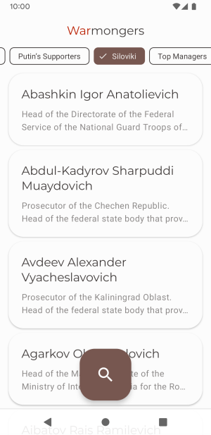
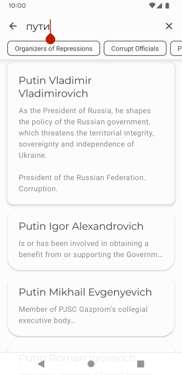

# Warmongr

Searchable list of bribetakers and warmongers. More info on https://acf.international.

<picture>
  <source media="(prefers-color-scheme: dark)" srcset="app/src/main/play/listings/en-US/graphics/phone-screenshots/1.png">
  
</picture>

<picture>
  <source media="(prefers-color-scheme: dark)" srcset="app/src/main/play/listings/en-US/graphics/phone-screenshots/2.png">
  
</picture>

